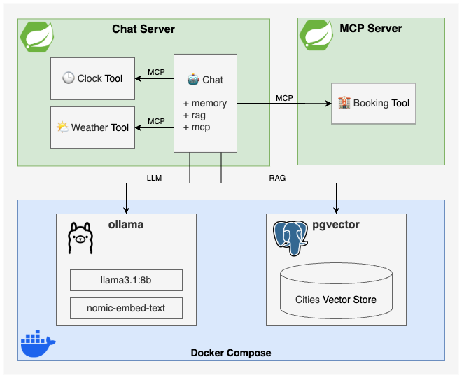

# Spring Boot AI

Inspired by [Building Agents with AWS: Complete Tutorial (Java, Spring AI, Amazon Bedrock & MCP)](https://youtu.be/Y291afdLroQ?si=3xFBJo0Nfa-RmPkV)



## Run locally

1. Start MCP server
```shell
cd mcp-server
./gradlew bootRun
```

2. Start docker compose
```shell
cd chat-server
docker compose up -d
```

3. Start Chat Server
```shell
cd chat-server
./gradlew bootRun
```

4. Execute queries

```shell
curl -X POST "http://localhost:8080/2/chat" \
-H "Content-Type: application/x-www-form-urlencoded" \
-d "question=I want to go to a city with a beach. Where should I go?"
```

```shell
curl -X POST "http://localhost:8080/2/chat" \
-H "Content-Type: application/x-www-form-urlencoded" \
-d "question=How is the weather like in Madrid for the weekend?"
```

## Documentation

* [Spring Boot AI](https://docs.spring.io/spring-ai/reference/index.html)
* Sample [spring-ai-java-bedrock-mcp-rag](https://github.com/aws-samples/Sample-Model-Context-Protocol-Demos/tree/main/modules/spring-ai-java-bedrock-mcp-rag)
