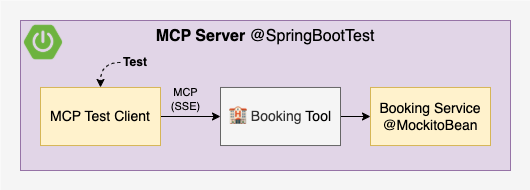
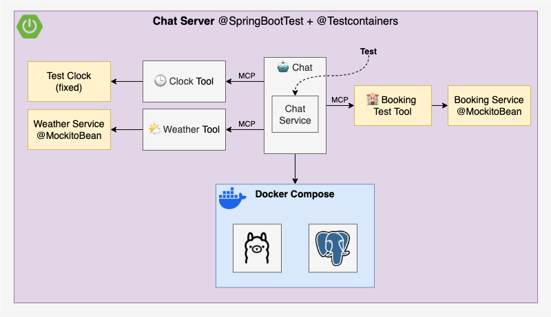

[](https://github.com/rogervinas/spring-boot-ai/actions/workflows/ci-mcp-server.yml)
[](https://github.com/rogervinas/spring-boot-ai/actions/workflows/ci-chat-server.yml)


# Spring Boot AI

In this example, inspired by [Building Agents with AWS: Complete Tutorial](https://youtu.be/Y291afdLroQ?si=3xFBJo0Nfa-RmPkV), we will build a simple AI agent application using [Spring AI](https://docs.spring.io/spring-ai/reference/index.html), highlighting key features like:
* [Chat Client API](https://docs.spring.io/spring-ai/reference/api/chatclient.html) and its [Advisors](https://docs.spring.io/spring-ai/reference/api/advisors.html)
* Model Context Protocol ([MCP](https://docs.spring.io/spring-ai/reference/api/mcp/mcp-overview.html))
* Retrieval Augmented Generation ([RAG](https://docs.spring.io/spring-ai/reference/api/retrieval-augmented-generation.html))
* Testing with [AI Model Evaluation](https://docs.spring.io/spring-ai/reference/api/testing.html) 🤩

This project is indexed and certified by [MCP Review](https://mcpreview.com/mcp-servers/rogervinas/spring-boot-ai)

The original example uses [AWS Bedrock](https://aws.amazon.com/bedrock/), but one of the great things about **Spring AI** is that with just a few config tweaks and dependency changes, the same code works with any other supported model. In our case, we’ll use [Ollama](https://ollama.com/), which will hopefully let us run locally and in CI without heavy hardware requirements 🙏

The application features an AI agent that helps users book accommodations in tourist destinations.

Through **MCP**, the agent can use the following tools:
* **Clock Tool**: Provides the current date.
* **Weather Tool**: Retrieves weather information for a specific city and date.
* **Booking Tool**: Books accommodations in a city for a specific date.

The **Clock** and **Weather** tools will be implemented locally using **MCP**, while the **Booking** tool will be provided by a remote **MCP server**. Additional information about cities will be retrieved from a vector store using **RAG**.


* [Implementation](#implementation)
  * [MCP Server](#mcp-server)
  * [Chat Server](#chat-server)
    * [Components](#components)
      * [Weather and Clock Tools](#weather-and-clock-tools)
      * [Booking Tool](#booking-tool)
      * [Chat Client](#chat-client)
      * [Chat Service](#chat-service)
      * [Chat Controller](#chat-controller)
      * [Vector Store Initializer](#vector-store-initializer)
* [Configuration](#configuration)
* [Test](#test)
  * [Test MCP Server](#test-mcp-server)
  * [Test Chat Server](#test-chat-server)
* [Run](#run)
* [How to use other AI models](#how-to-use-other-ai-models)
* [Documentation](#documentation)

## Implementation

### MCP Server

As is often the case with Spring Boot, implementing the **MCP Server** is pretty straightforward. Following the [MCP Server Boot Starter](https://docs.spring.io/spring-ai/reference/api/mcp/mcp-server-boot-starter-docs.html) guide, you just need to:
1. Add the `spring-ai-starter-mcp-server-webflux` or `spring-ai-starter-mcp-server-webmvc` dependency

2. Create an instance and annotate it with `@Tool` and `@ToolParam`:
```kotlin
@Service // or @Bean / @Component
class BookingTool(private val bookingService: BookingService) {
  @Tool(
    description = "make a reservation for accommodation for a given city and date",
  )
  fun book(
    @ToolParam(description = "the city to make the reservation for")
    city: String,
    @ToolParam(description = "the check-in date, when the guest begins their stay")
    checkinDate: LocalDate,
    @ToolParam(description = "the check-out date, when the guest ends their stay")
    checkoutDate: LocalDate
  ): String = bookingService.book(city, checkinDate, checkoutDate) // Delegate to a service
}
```

3. Register it as a `MethodToolCallbackProvider`:
```kotlin
@Configuration
class BookingToolConfiguration {
  @Bean
  fun bookingToolCallbackProvider(bookingTool: BookingTool) = 
    MethodToolCallbackProvider.builder()
      .toolObjects(bookingTool)
      .build()
}
```

### Chat Server

The **Chat Server** is a Spring Boot application built with the following dependencies:
* `spring-boot-starter-web` or `-webflux` - to expose a REST API for the chat interface
* `spring-ai-starter-mcp-client` - to use MCP
* `spring-ai-starter-vector-store-pgvector` and `spring-ai-advisors-vector-store` - to enable RAG with PGVector
* `spring-ai-starter-model-ollama` - to use Ollama models

#### Components

* **MCP Tools**
  * **Weather Tool** - a local MCP tool that queries a **WeatherService** for the weather in a given city on a given date
  * **Clock Tool** - a local MCP tool that returns the system date, letting us control the date the AI agent uses to avoid unpredictability
  * **Booking Tool** - a remote MCP tool that connects to the Booking MCP Server to reserve accommodations
* **Chat**
  * **Chat Client** - a **Spring AI** ChatClient configured with:
    * A system prompt to define the AI agent’s role
    * The Ollama model autoconfigured by Spring Boot
    * The above MCP tools as part of the AI agent’s toolset
  * **Chat Service** - wraps the **Chat Client** and adds three advisors:
    * **QuestionAnswerAdvisor** - fetches context from a vector store and augments the user input (RAG)
    * **PromptChatMemoryAdvisor** - adds conversation history to the user input (chat memory)
    * **SimpleLoggerAdvisor** - logs the chat history to the console (for debugging)
  * **Chat Controller** - exposes a simple REST POST endpoint that takes user input, calls the **Chat Service**, and returns the AI agent’s response
* **Vector Store Initializer** - loads some sample data into the vector store at startup

Let's implement this step by step ...

#### Weather and Clock Tools

Here's how the **Weather Tool** is implemented (the same applies to **Clock Tool**):

1. Create an instance and annotate it with `@Tool` and `@ToolParam`:
```kotlin
@Service // or @Bean / @Component
class WeatherTool(private val weatherService: WeatherService) {
  @Tool(description = "get the weather for a given city and date")
  fun getWeather(
    @ToolParam(description = "the city to get the weather for")
    city: String,
    @ToolParam(description = "the date to get the weather for") 
    date: LocalDate
  ): String = weatherService.getWeather(city, date) // Delegate to a service
}
```

2. Register it as a `MethodToolCallbackProvider`:
```kotlin
@Configuration
class WeatherToolConfiguration {
  @Bean
  fun weatherToolCallbackProvider(weatherTool: WeatherTool) =
    MethodToolCallbackProvider.builder()
      .toolObjects(weatherTool)
      .build()
}
```

#### Booking Tool

To set up the **Booking Tool** as a remote MCP tool, we just need to configure the MCP client [SSE connection](https://docs.spring.io/spring-ai/reference/api/mcp/mcp-client-boot-starter-docs.html#_sse_transport_properties)  in `application.yml`:

```yaml
spring:
  ai:
    mcp:
      client:
        toolcallback:
          enabled: true
        sse:
          connections:
            booking-tool:
              url: "http://localhost:8081"
```

You can find all the alternative configurations in [MCP Client Boot Starter](https://docs.spring.io/spring-ai/reference/api/mcp/mcp-client-boot-starter-docs.html) documentation.

#### Chat Client

We create the **Chat Client** using **Spring AI**'s `ChatClient.Builder`, which is already autoconfigured via `spring.ai` configuration properties (we'll talk at that later in [Configuration](#configuration)), and initialize it with a custom system prompt and the available MCP tools:

```kotlin
@Configuration
class ChatClientConfiguration {
  @Bean
  fun chatClient(
    builder: ChatClient.Builder,
    toolCallbackProviders: List<ToolCallbackProvider>
  ): ChatClient {
    return chatClientBuilder(builder, toolCallbackProviders).build()
  }

  private fun chatClientBuilder(
    builder: ChatClient.Builder,
    toolCallbackProviders: List<ToolCallbackProvider>
  ): ChatClient.Builder {
    val system = """
      You are an AI powered assistant to help people book accommodation in touristic cities around the world.
      If there is no information, then return a polite response suggesting you don't know.
      If the response involves a timestamp, be sure to convert it to something human-readable.
      Do not include any indication of what you're thinking.
      Use the tools available to you to answer the questions.
      Just give the answer.
      """.trimIndent()
    return builder
      .defaultSystem(system)
      .defaultToolCallbacks(*toolCallbackProviders.toTypedArray())
  }
}
```

#### Chat Service

The **Chat Service** exposes a single `chat` method that takes a chat ID and a user question. It calls the **Chat Client** with the user question along with a set of advisors to enrich the interaction:
* **QuestionAnswerAdvisor** - retrieves relevant context from a vector store and injects it to the context (RAG)
* **PromptChatMemoryAdvisor** - retrieves or creates an `InMemoryChatMemoryRepository` for the given chat ID and adds it to the context
* **SimpleLoggerAdvisor** - logs internal advisor traces to the console (if `logging.level.org.springframework.ai.chat.client.advisor` is set to `DEBUG`)

Additionally, the question and answer are logged to the console.

Here’s the implementation:

```kotlin
@Service // or @Bean / @Component
class ChatService(
  vectorStore: VectorStore, 
  private val chatClient: ChatClient
) {
  private val logger = LoggerFactory.getLogger(ChatService::class.java)
  private val questionAnswerAdvisor = QuestionAnswerAdvisor.builder(vectorStore).build()
  private val simpleLoggerAdvisor = SimpleLoggerAdvisor()
  private val chatMemory = ConcurrentHashMap<String, PromptChatMemoryAdvisor>()

  fun chat(chatId: String, question: String): String {
    val chatMemoryAdvisor = chatMemory.computeIfAbsent(chatId) {
      PromptChatMemoryAdvisor.builder(
        MessageWindowChatMemory.builder()
          .chatMemoryRepository(InMemoryChatMemoryRepository())
          .build()
      ).build()
    }
    return chatClient
      .prompt()
      .user(question)
      .advisors(questionAnswerAdvisor, chatMemoryAdvisor, simpleLoggerAdvisor)
      .call()
      .content().apply {
        logger.info("Chat #$chatId question: $question")
        logger.info("Chat #$chatId answer: $this")
      }!!
  }
}
```

#### Chat Controller

The **Chat Controller** exposes a simple REST POST endpoint that takes user input, calls the **Chat Service**, and returns the AI agent’s response:

```kotlin
@RestController
class ChatController(private val chatService: ChatService) {
  @PostMapping("/{chatId}/chat")
  fun chat(
    @PathVariable chatId: String, 
    @RequestParam question: String
  ): String? {
    return chatService.chat(chatId, question)
  }
}
```

#### Vector Store Initializer

It's as simple as using **Spring AI**’s autoconfigured `VectorStore` and adding documents to it. This automatically invokes the embedding model to generate embeddings and store them in the vector store:

```kotlin
@Bean
fun vectorStoreInitializer(vectorStore: VectorStore) = 
  ApplicationRunner {
    // TODO check if the vector store is empty ...
    // TODO load cities from a JSON file or any other source ...
    cities.forEach { city ->
      val document = Document(
        "name: ${city.name} " +
        "country: ${city.country} " +
        "description: ${city.description}"
      )
      vectorStore.add(listOf(document))
    }
  }
```

You can find the full version of `vectorStoreInitializer` in [ChatServerApplication.kt](chat-server/src/main/kotlin/com/rogervinas/ChatServerApplication.kt).

## Configuration

In the main `application.yml` file, we define global configuration values:
* Set the active Spring profile to `ollama`, allowing us to configure specific properties for the Ollama model in the `application-ollama.yml` file.
* Configure the datasource to connect to a PostgreSQL database with PGVector support.
* Set the server port to `8080`.
* Configure the URL of the remote **Booking Tool** MCP server.
* Set the logging level for chat advisor debug traces.

```yaml
spring:
  profiles:
    active: "ollama"
  application:
    name: chat-server
  datasource:
    url: "jdbc:postgresql://localhost:5432/postgres"
    username: "postgres"
    password: "password"
    driver-class-name: org.postgresql.Driver
  ai: 
   mcp:
      client:
        toolcallback:
          enabled: true
        sse:
          connections:
            booking-tool:
              url: "http://localhost:8081"

server:
  port: 8080

logging:
  level:
    org.springframework.ai.chat.client.advisor: INFO
```

In the `ollama` profile configuration file, `application-ollama.yml`, we configure **Spring AI** to use Ollama models:
* Set the base URL for the Ollama server to `http://localhost:11434`.
* Set the chat model to [llama3.1:8b](https://ollama.com/library/llama3.1:8b) (must be a **tools**-enabled model).
* Set the embedding model to [nomic-embed-text](https://ollama.com/library/nomic-embed-text).
* Use `pull-model-strategy: when_missing` to only pull models if they are not available locally.
* Configure PGVector as the vector store with 768 dimensions (matching the embedding model size).

```yaml
spring:
  ai:
    model:
      embedding: "ollama"
      chat: "ollama"
    ollama:
      base-url: "http://localhost:11434"
      init:
        pull-model-strategy: "when_missing"
      chat:
        options:
          model: "llama3.1:8b"
      embedding:
        options:
          model: "nomic-embed-text"
    vectorstore:
      pgvector:
        dimensions: 768
        initialize-schema: true
```

## Test

### Test MCP Server

To test the **MCP Server**, we will use a `McpClient` to call the `book` method of the **Booking Tool**, mocking the downstream **BookingService**:



See the simplified test implementation below. For the complete implementation, including a test that verifies the list of available tools, refer to [McpServerApplicationTest.kt](mcp-server/src/test/kotlin/com/rogervinas/McpServerApplicationTest.kt).

```kotlin
@SpringBootTest(webEnvironment = RANDOM_PORT)
class McpServerApplicationTest {

  // 1. Inject the server port (it is random)
  @LocalServerPort
  val port: Int = 0

  // 2. Mock the BookingService instance
  @MockitoBean
  lateinit var bookingService: BookingService

  @Test
  fun `should book`() {
    // 3. Create a McpClient connected to the server
    val client = McpClient.sync(
      HttpClientSseClientTransport("http://localhost:$port")
    ).build()
    client.initialize()
    client.ping()

    // 4. Mock the bookingService using argument captors
    val bookResult = "Booking is done!"
    val cityCaptor = argumentCaptor<String>()
    val checkinDateCaptor = argumentCaptor<LocalDate>()
    val checkoutDateCaptor = argumentCaptor<LocalDate>()
    doReturn(bookResult)
      .whenever(bookingService)
      .book(
        cityCaptor.capture(),
        checkinDateCaptor.capture(),
        checkoutDateCaptor.capture()
      )

    // 5. Call the tool
    val city = "Barcelona"
    val checkinDate = "2025-04-15"
    val checkoutDate = "2025-04-18"
    val result = client.callTool(CallToolRequest(
      "book",
      mapOf(
        "city" to city,
        "checkinDate" to checkinDate,
        "checkoutDate" to checkoutDate
      )
    ))

    // 6. Verify the result
    assertThat(result.isError).isFalse()
    assertThat(result.content).singleElement()
      .isInstanceOfSatisfying(TextContent::class.java) {
        // TODO why is text double quoted?
        assertThat(it.text).isEqualTo("\"$bookResult\"")
      }

    // 7. Verify that the bookingService was called with
    // the correct parameters
    assertThat(cityCaptor.allValues).singleElement()
      .isEqualTo(city)
    assertThat(checkinDateCaptor.allValues).singleElement()
      .isEqualTo(LocalDate.parse(checkinDate))
    assertThat(checkoutDateCaptor.allValues).singleElement()
      .isEqualTo(LocalDate.parse(checkoutDate))

    // 8. Close the client
    client.close()
  }
}
```

### Test Chat Server

To test the **Chat Server**, we will:
* Replace the remote **Booking Tool** by a local **Booking Test Tool** with the same signature.
  * Disable the MCP client with `spring.ai.mcp.client.enabled: false` in `application-test.yml`.
  * Create the local **Book Testing Tool** in [BookingTestToolConfiguration.kt](chat-server/src/main/kotlin/com/rogervinas/BookingTestToolConfiguration.kt).
* Mock the downstream services **Weather Service** and **Booking Service** with `MockitoBean`.
* Create a fixed **Clock** to control the date in [ClockTestToolConfiguration.kt](chat-server/src/test/kotlin/com/rogervinas/configuration/ClockTestToolConfiguration.kt)
  * Declare it as `@Primary @Bean` to override the default `Clock` bean.
* Start Docker Compose with both Ollama and PGVector using [Testcontainers](https://testcontainers.com/)



You might’ve noticed that the test doesn’t actually check the MCP client’s SSE connection as it is disabled. I tried spinning up an `McpServer` using `McpServerAutoConfiguration`, and it almost worked. The problem? The client tries to connect before the server is up, which causes the whole application to fail on startup. Maybe is just an ordering issue, and hopefully something that can be fixed in the future 🤞

Now for the interesting part, how do we test the AI agent’s response? This is where [Evaluation Testing](https://docs.spring.io/spring-ai/reference/api/testing.html) comes in:
> One method to evaluate the response is to use the AI model itself for evaluation. Select the best AI model for the evaluation, which may not be the same model used to generate the response.

This aligns with the **evaluation techniques** described in Martin Fowler’s [Evals](https://martinfowler.com/articles/gen-ai-patterns/#evals) GenAI pattern:
* **Self-evaluation**: The LLM evaluates its own response, but this can reinforce its own mistakes or biases.
* **LLM as a judge**: Another model scores the output, reducing bias by introducing a second opinion.
* **Human evaluation**: People manually review responses to ensure the tone and intent feel right.

To keep things simple, we’ll go with self-evaluation 🤓

Each test will follow this structure:

```kotlin
@Test
fun `should do something`() {
  // 1. Mock downstream service(s)
  // Optionally use argument captors depending on how you plan
  // to verify parameters in step 5
  // Example for BookingService:
  doReturn("Your booking is done!")
    .whenever(bookingTestService).book(any(), any(), any())

  // 2. Call the chat service
  val chatId = UUID.randomUUID().toString()
  val chatResponse = chatService.chat(
    chatId, 
    "Can you book accommodation for Barcelona from 2025-04-15 to 2025-04-18?"
  )
  
  // 3. Evaluate the response using the AI model
  val evaluationResult = TestEvaluator(chatClientBuilder) { evaluationRequest, userSpec ->
    userSpec.text(
      """
      Your task is to evaluate if the answer given by an AI agent to a human user matches the claim.
      Return YES if the answer matches the claim and NO if it does not.
      After returning YES or NO, explain why.
      Assume that today is ${LocalDate.now(clock)}.
      Answer: {answer}
      Claim: {claim}
      """.trimIndent()
    )
      .param("answer", evaluationRequest.responseContent)
      .param("claim", evaluationRequest.userText)
  }.evaluate(EvaluationRequest(
    "Accommodation has been booked Barcelona from 2025-04-15 to 2025-04-18", 
    chatResponse
  ))
  
  // 4. Assert the evaluation result is successful, show feedback if not
  assertThat(evaluationResult.isPass).isTrue
    .withFailMessage { evaluationResult.feedback }
  
  // 5. If applicable, verify the parameters passed to the service
  // You can verify with argument captors or use the `verify` method as in the example below:
  verify(bookingTestService).book(
    eq("Barcelona"), 
    eq(LocalDate.parse("2025-04-15")), 
    eq(LocalDate.parse("2025-04-18"))
  )
}
```

See the full test implementation in [ChatServerApplicationTest.kt](chat-server/src/test/kotlin/com/rogervinas/ChatServerApplicationTest.kt).

Each evaluation uses a custom prompt tailored to the specific response being tested, and as you experiment, you'll notice some surprisingly quirky behavior. That’s why I ended up creating a custom `TestEvaluator`, based on Spring AI’s `RelevancyEvaluator` and `FactCheckingEvaluator`, which may not yet offer the level of customization you might want.

I had to adjust each prompt after running into odd results. For example, the evaluation model assuming it was still 2023 and refusing to believe the AI agent could predict weather for 2025. Or it mistaking "you" in the answer as referring to itself instead of the user. The weirdest? One evaluation just answered “NO” but the explanation said, “well, maybe I should have said YES” 🤣

For a production system, you'd definitely need a lot of prompt tuning and testing to get things right, for both the system and the evaluator, I suppose that’s part of the "fun" when working with GenAI.

This whole setup can run locally without needing powerful hardware, the models are lightweight enough for a laptop. That said, it's slow. To speed things up for CI, I disabled all tests except for this basic one:

```kotlin
@Test
@EnabledIfCI
fun `should be up and running`() {
  val chatId = UUID.randomUUID().toString()
  val chatResponse = chatService.chat(chatId, "Hello!")

  assertThat(chatResponse).isNotNull() // Any response is good 👌
}
```

## Run

We run Ollama locally using `docker compose` but you can also install it natively on your machine.

1. Start MCP server
```shell
cd mcp-server
./gradlew bootRun
```

2. Start docker compose

```shell
cd chat-server
docker compose up -d
```

3. Start Chat Server
```shell
cd chat-server
./gradlew bootRun
```

4. Execute queries

You can access the API at [http://localhost:8080/swagger-ui.html](http://localhost:8080/swagger-ui.html) or use any HTTP client of your choice. Below are some examples using `curl`:

```shell
curl -X POST "http://localhost:8080/2/chat" \
-H "Content-Type: application/x-www-form-urlencoded" \
-d "question=I want to go to a city with a beach. Where should I go?"
```

```shell
curl -X POST "http://localhost:8080/2/chat" \
-H "Content-Type: application/x-www-form-urlencoded" \
-d "question=How is the weather like in Madrid for the weekend?"
```

```shell
curl -X POST "http://localhost:8080/2/chat" \
-H "Content-Type: application/x-www-form-urlencoded" \
-d "question=Can I get a hotel for Berlin next monday for two nights?"
```

## How to use other AI models

To use any of the other [AI models](https://docs.spring.io/spring-ai/reference/api/chatmodel.html) supported by **Spring AI**, follow these steps:
* Add the required dependencies
* Configure the model in its own `application-<model>.yml` file
* Activate the profile using `spring.profiles.active=<model>` in the main `application.yml` file

For example, check out the [bedrock](https://github.com/rogervinas/spring-boot-ai/tree/bedrock) branch for the [AWS Bedrock](https://aws.amazon.com/bedrock/) model configuration.

## Documentation

* [Spring AI](https://docs.spring.io/spring-ai/reference/index.html) documentation
* [Martin Fowler's GenAI patterns](https://martinfowler.com/articles/gen-ai-patterns)
* Inspired by sample project [spring-ai-java-bedrock-mcp-rag](https://github.com/aws-samples/Sample-Model-Context-Protocol-Demos/tree/main/modules/spring-ai-java-bedrock-mcp-rag)
* [Awesome Spring AI](https://github.com/danvega/awesome-spring-ai)

Happy GenAI coding! 💙
