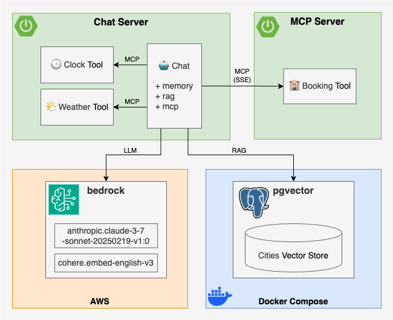

[](https://github.com/rogervinas/spring-boot-ai/actions/workflows/ci-mcp-server.yml)
[](https://github.com/rogervinas/spring-boot-ai/actions/workflows/ci-chat-server.yml)


# Spring Boot AI

In this example, inspired by [Building Agents with AWS: Complete Tutorial](https://youtu.be/Y291afdLroQ?si=3xFBJo0Nfa-RmPkV), we will build a simple AI agent application using [Spring Boot AI](https://docs.spring.io/spring-ai/reference/index.html), highlighting key features like:
* [Chat Client API](https://docs.spring.io/spring-ai/reference/api/chatclient.html) and its [Advisors](https://docs.spring.io/spring-ai/reference/api/advisors.html)
* Model Context Protocol ([MCP](https://docs.spring.io/spring-ai/reference/api/mcp/mcp-overview.html))
* Retrieval Augmented Generation ([RAG](https://docs.spring.io/spring-ai/reference/api/retrieval-augmented-generation.html))

We will use [Ollama](https://ollama.com/), which will hopefully let us run a local LLM without too much struggle 😮‍💨 or heavy hardware requirements. The application will be tested using [AI Model Evaluation](https://docs.spring.io/spring-ai/reference/api/testing.html), and we will set up CI to run these tests automatically.

The application features an AI agent that helps users book accommodations in tourist destinations.

Through **MCP**, the agent can use the following tools:
* **Clock Tool**: Provides the current date.
* **Weather Tool**: Retrieves weather information for a specific city and date.
* **Booking Tool**: Books accommodations in a city for a specific date.

The **Clock** and **Weather** tools will be implemented locally using **MCP**, while the **Booking** tool will be provided by a remote **MCP server**. Additional information about cities will be retrieved from a vector store using **RAG**.



* [Implementation](#implementation)
  * [MCP Server](#mcp-server)
  * [Chat Server](#chat-server)
    * [Components](#components)
      * [Weather and Clock Tools](#weather-and-clock-tools)
      * [Booking Tool](#booking-tool)
      * [ChatClient](#chatclient)
      * [ChatService](#chatservice)
      * [ChatController](#chatcontroller)
* [Configuration](#configuration)
* [Test](#test)
* [Run](#run)
* [Other AI models](#other-ai-models)
* [Documentation](#documentation)

## Implementation

### MCP Server

As is often the case with Spring Boot, implementing the **MCP Server** is pretty straightforward. Following the [MCP Server Boot Starter](https://docs.spring.io/spring-ai/reference/api/mcp/mcp-server-boot-starter-docs.html) guide, you just need to:
1. Add the `spring-ai-starter-mcp-server-webflux` or `spring-ai-starter-mcp-server-webmvc` dependency

2. Create an instance and annotate it with `@Tool` and `@ToolParam`:
```kotlin
@Service // or @Bean / @Component
class BookingTool(private val bookingService: BookingService) {
    @Tool(
        description = "make a reservation for accommodation for a given city and date",
    )
    fun book(
        @ToolParam(description = "the city to make the reservation for") city: String,
        @ToolParam(description = "the check-in date, when the guest begins their stay") checkinDate: LocalDate,
        @ToolParam(description = "the check-out date, when the guest ends their stay") checkoutDate: LocalDate
    ): String = bookingService.book(city, checkinDate, checkoutDate) // Delegate to a service
}
```

3. Register it as a `MethodToolCallbackProvider`: 
```kotlin
@Configuration
class BookingToolConfiguration {
    @Bean
    fun bookingToolCallbackProvider(bookingTool: BookingTool) = MethodToolCallbackProvider.builder()
        .toolObjects(bookingTool)
        .build()
}
```

### Chat Server

The **Chat Server** is a Spring Boot application built with the following dependencies:
* `org.springframework.boot:spring-boot-starter-web` - to expose a REST API for the chat interface
* `org.springframework.ai:spring-ai-mcp-client-spring-boot-starter` - to use MCP
* `org.springframework.ai:spring-ai-pgvector-store-spring-boot-starter` - to enable RAG with PGVector
* `org.springframework.ai:spring-ai-ollama-spring-boot-starter` - to use Ollama models

#### Components

**MCP Tools**
* **WeatherTool** - a local MCP tool that queries a **WeatherService** for the weather in a given city on a given date
* **ClockTool** - a local MCP tool that uses the system Clock to return the current date
* **BookingTool** - a remote MCP tool that connects to the Booking MCP Server to reserve accommodations

**Chat**
* **ChatClient** - a Spring AI ChatClient configured with:
  * A system prompt to define the AI agent’s role
  * The Ollama model autoconfigured by Spring Boot
  * The above MCP tools as part of the AI agent’s toolset
* **ChatService** - wraps the **ChatClient** and adds three advisors:
  * **QuestionAnswerAdvisor** - fetches context from a vector store and augments the user input (RAG)
  * **PromptChatMemoryAdvisor** - adds conversation history to the user input (chat memory)
  * **SimpleLoggerAdvisor** - logs the chat history to the console (for debugging)
* **ChatController** - exposes a simple REST POST endpoint that takes user input, calls the **ChatService**, and returns the AI agent’s response

Let's implement this step by step ...

##### Weather and Clock Tools

Here's how the **WeatherTool** is implemented (the same applies to **ClockTool**):

1. Create an instance and annotate it with `@Tool` and `@ToolParam`:
```kotlin
@Service // or @Bean / @Component
class WeatherTool(private val weatherService: WeatherService) {
    @Tool(description = "get the weather for a given city and date")
    fun getWeather(
        @ToolParam(description = "the city to get the weather for") city: String,
        @ToolParam(description = "the date to get the weather for") date: LocalDate
    ): String = weatherService.getWeather(city, date) // Delegate to a service
}
```

2. Register it as a `MethodToolCallbackProvider`:
```kotlin
@Configuration
class WeatherToolConfiguration {
    @Bean
    fun weatherToolCallbackProvider(weatherTool: WeatherTool) = MethodToolCallbackProvider.builder()
        .toolObjects(weatherTool)
        .build()
}
```

##### Booking Tool

To set up the **BookingTool** as a remote MCP tool, we register a `SyncMcpToolCallbackProvider` using an `McpClient` configured with the remote MCP server URL:

```kotlin
@Configuration
class BookingToolConfiguration {
    @Bean
    fun bookingToolCallbackProvider(@Value("\${booking-server.url}") url: String) =
        SyncMcpToolCallbackProvider(mcpSyncClient(url))

    private fun mcpSyncClient(url: String) = McpClient
        .sync(HttpClientSseClientTransport(url))
        .build().apply {
            initialize()
        }
}
```

For alternative ways to configure it, see the [MCP Client Boot Starter](https://docs.spring.io/spring-ai/reference/api/mcp/mcp-client-boot-starter-docs.html) documentation.

##### ChatClient

We create the **ChatClient** using Spring Boot AI's `ChatClient.Builder`, which is already autoconfigured via `spring.ai` configuration properties (we’ll look at that later), and initialize it with a custom system prompt and the available MCP tools:

```kotlin
@Configuration
class ChatClientConfiguration {
  @Bean
  fun chatClient(
    builder: ChatClient.Builder,
    toolCallbackProviders: List<ToolCallbackProvider>
  ): ChatClient {
    return chatClientBuilder(builder, toolCallbackProviders).build()
  }

  private fun chatClientBuilder(
    builder: ChatClient.Builder,
    toolCallbackProviders: List<ToolCallbackProvider>
  ): ChatClient.Builder {
    val system = """
        You are an AI powered assistant to help people book accommodation in touristic cities around the world.
        If there is no information, then return a polite response suggesting you don't know.
        If the response involves a timestamp, be sure to convert it to something human-readable.
        Do not include any indication of what you're thinking.
        Use the tools available to you to answer the questions.
        Just give the answer.
        """.trimIndent()
    return builder
      .defaultSystem(system)
      .defaultTools(*toolCallbackProviders.toTypedArray())
  }
}
```

##### ChatService

The **ChatService** exposes a single `chat` method that takes a chat ID and a user question. It calls the `ChatClient` with the user question along with a set of advisors to enrich the interaction:
* **QuestionAnswerAdvisor** - retrieves relevant context from a vector store and injects it to the context (RAG)
* **PromptChatMemoryAdvisor** - retrieves or creates an `InMemoryChatMemory` for the given chat ID and adds it to the context
* **SimpleLoggerAdvisor** - logs internal advisor traces to the console (if `logging.level.org.springframework.ai.chat.client.advisor` is set to `DEBUG`)

Additionally, the question and answer are logged to the console.

Here’s the implementation:

```kotlin
@Service // or @Bean / @Component
class ChatService(vectorStore: VectorStore, private val chatClient: ChatClient) {

    private val logger = LoggerFactory.getLogger(ChatService::class.java)
    private val questionAnswerAdvisor = QuestionAnswerAdvisor(vectorStore)
    private val simpleLoggerAdvisor = SimpleLoggerAdvisor()
    private val chatMemory = ConcurrentHashMap<String, PromptChatMemoryAdvisor>()

    fun chat(chatId: String, question: String): String? {
        val chatMemoryAdvisor = chatMemory.computeIfAbsent(chatId) {
            PromptChatMemoryAdvisor.builder(InMemoryChatMemory()).build()
        }
        return chatClient
            .prompt()
            .user(question)
            .advisors(questionAnswerAdvisor, chatMemoryAdvisor, simpleLoggerAdvisor)
            .call()
            .content().apply {
                logger.info("Chat #$chatId question: $question")
                logger.info("Chat #$chatId answer: $this")
            }
    }
}
```

##### ChatController

The **ChatController** exposes a simple REST POST endpoint that takes user input, calls the `ChatService`, and returns the AI agent’s response:

```kotlin
@RestController
class ChatController(private val chatService: ChatService) {

    @PostMapping("/{chatId}/chat")
    fun chat(@PathVariable chatId: String, @RequestParam question: String): String? {
        return chatService.chat(chatId, question)
    }
}
```

## Configuration

In the main `application.yml` file, we define global configuration values:
* Set the active Spring profile to `ollama`, allowing us to configure specific properties for the Ollama model in the `application-ollama.yml` file.
* Configure the datasource to connect to a PostgreSQL database with PGVector support.
* Set the server port to `8080`.
* Configure the URL of the remote **BookingTool** MCP server.
* Set the logging level for chat advisor debug traces.

```yaml
spring:
  profiles:
    active: "ollama"
  application:
    name: chat-server
  datasource:
    url: "jdbc:postgresql://localhost:5432/postgres"
    username: "postgres"
    password: "password"
    driver-class-name: org.postgresql.Driver

server:
  port: 8080

booking-server:
  url: "http://localhost:8081"

logging:
  level:
    org.springframework.ai.chat.client.advisor: INFO
```

In the `ollama` profile configuration file, `application-ollama.yml`, we configure Spring AI to use Ollama models:
* Set the base URL for the Ollama server to `http://localhost:11434`.
* Set the chat model to [llama3.1:8b](https://ollama.com/library/llama3.1:8b) (must be a **tools**-enabled model).
* Set the embedding model to [nomic-embed-text](https://ollama.com/library/nomic-embed-text).
* Use `pull-model-strategy: when_missing` to only pull models if they are not available locally.
* Configure PGVector as the vector store with 768 dimensions (matching the embedding model size).

```yaml
spring:
  ai:
    ollama:
      base-url: "http://localhost:11434"
      init:
        pull-model-strategy: "always"
      chat:
        enabled: true
        options:
          model: "llama3.1:8b"
      embedding:
        enabled: true
        model: "nomic-embed-text"
    vectorstore:
      pgvector:
        dimensions: 768
        initialize-schema: true
```

## Test

TODO

## Run

We run Ollama locally using `docker compose` but you can also install it natively on your machine.

1. Start MCP server
```shell
cd mcp-server
./gradlew bootRun
```

2. Start docker compose

```shell
cd chat-server
docker compose up -d
```

3. Start Chat Server
```shell
cd chat-server
./gradlew bootRun
```

4. Execute queries

```shell
curl -X POST "http://localhost:8080/2/chat" \
-H "Content-Type: application/x-www-form-urlencoded" \
-d "question=I want to go to a city with a beach. Where should I go?"
```

```shell
curl -X POST "http://localhost:8080/2/chat" \
-H "Content-Type: application/x-www-form-urlencoded" \
-d "question=How is the weather like in Madrid for the weekend?"
```

```shell
curl -X POST "http://localhost:8080/2/chat" \
-H "Content-Type: application/x-www-form-urlencoded" \
-d "question=Can I get a hotel for Berlin next monday for two nights?"
```

## Other AI models

To use a different [AI models](https://docs.spring.io/spring-ai/reference/api/chatmodel.html) supported by Spring AI, follow these steps:
* Add the required dependencies
* Configure the model in its own `application-<model>.yml` file
* Activate the profile using `spring.profiles.active=<model>` in the main `application.yml` file

## Documentation

* [Spring Boot AI](https://docs.spring.io/spring-ai/reference/index.html) documentation
* Example project: [spring-ai-java-bedrock-mcp-rag](https://github.com/aws-samples/Sample-Model-Context-Protocol-Demos/tree/main/modules/spring-ai-java-bedrock-mcp-rag)
